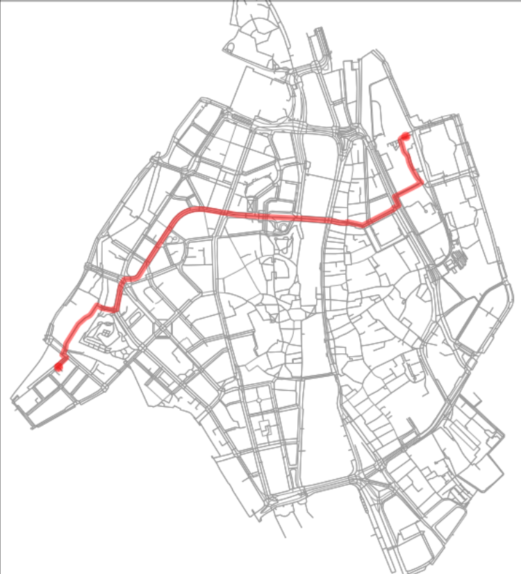

# Geospatial-Data-Analysis-in-Python
This repository contains a Jupyter notebook focused on geospatial data analysis using Python. It covers the installation of necessary dependencies, data manipulation, visualization, and analysis techniques commonly used in geospatial projects.

## Table of Contents

- [Introduction](#introduction)
- [Installation](#installation)
- [Usage](#usage)
- [Features](#features)
- [License](#license)

## Introduction

Geospatial data analysis is an essential aspect of understanding spatial patterns and relationships in various domains. This notebook provides a step-by-step guide to performing geospatial analysis in Python, leveraging powerful libraries like GeoPandas, Shapely, and Folium.

## Installation

To run this notebook, you have to just clone it. You can do this by running the following command:

```bash
git clone https://github.com/cizodevahm/Geospatial-Data-Analysis-in-Python.git
```

Ensure you have Jupyter installed, and then launch the notebook using:

```bash
jupyter notebook
```

## Usage

Clone this repository and open the `Geospatial Data Analysis in Python.ipynb` notebook in Jupyter. The notebook includes the following sections:

- **Data Loading**: Instructions on loading geospatial datasets.
- **Data Manipulation**: Techniques for manipulating geospatial data using Python.
- **Visualization**: Visualization of spatial data using various plotting libraries.
- **Analysis**: Performing spatial analysis, including spatial joins and aggregations.

## Features

- Loading and exploring geospatial datasets
- Manipulating spatial data using GeoPandas
- Visualizing spatial data with Folium and Matplotlib
- Conducting spatial analysis, including spatial joins and aggregations

## Example


## License

This project is licensed under the GPL-3.0 license - see the [LICENSE](LICENSE) file for details.
